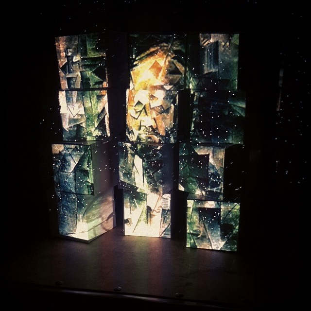
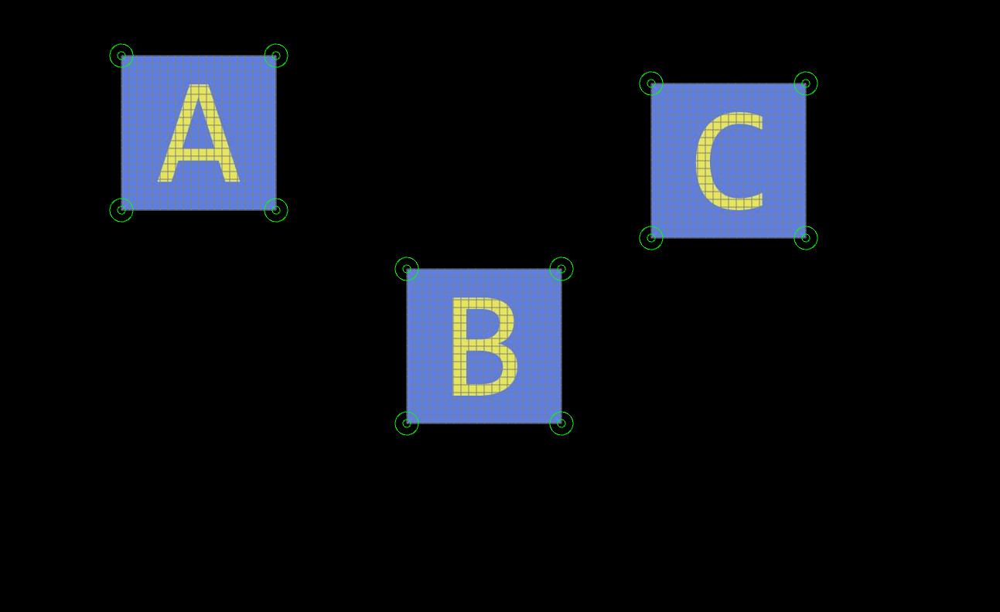
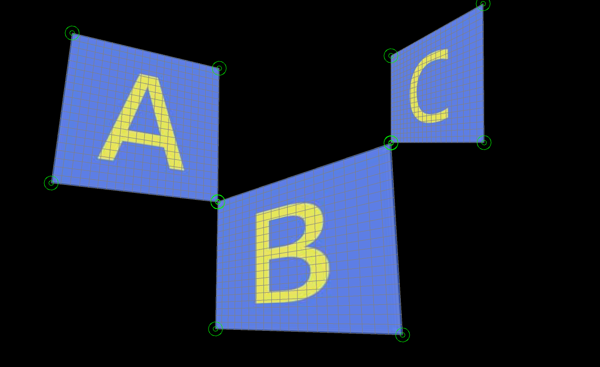

# projection

Test for the deadpixel.keystone library, which basically allows you to warp your Processing sketches onto any flat surface by using corner pin keystoning. This test sketch takes 3 images, but you can add as many as you like. The photo below for example takes 12 images. What you see below is a Picasso painting, deconstructed and projected onto white cubes. Cubes within cubism :) 

A glimpse of the process : 

More on the website >> http://keystonep5.sourceforge.net

More of my work here >> http://celine.work/